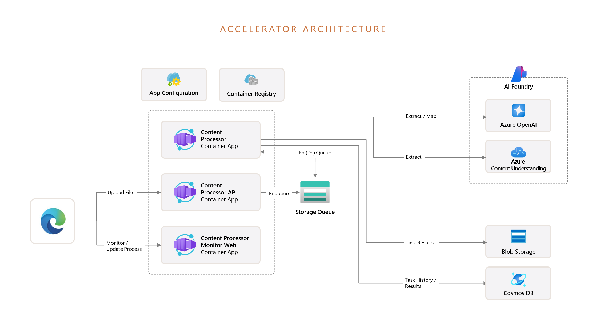

# Content Processing Solution Accelerator

MENU: [**USER STORY**](#user-story) \| [**QUICK DEPLOY**](#quick-deploy)  \| [**SUPPORTING DOCUMENTATION**](#supporting-documentation) 

<h2>
 
User story
</h2>

### Overview

This solution accelerator enables customers to programmatically extract data and apply schemas to unstructured documents across text-based and multi-modal content. During processing, extraction and data schema transformation - these steps are scored for accuracy to automate processing and identify as-needed human validation. This allows for improved accuracy and greater speed for data integration into downstream systems.

It leverages Azure AI Foundry, Azure AI Content Understanding, Azure OpenAI Service, Azure blob storage, and Azure Cosmos DB to transform large volumes of unstructured content through event-driven processing pipelines for integration into downstream applications and post-processing activities.

### Technical key features

- **Multi-modal content processing:** Utilizes machine learning-based OCR for efficient text extraction and integrates GPT Vision for processing various content formats.​

- **Schema-based data transformation:** Maps extracted content to custom or industry-defined schemas and outputs as JSON for interoperability.​

- **Confidence scoring:** Calculation of entity extraction and schema mapping processes for accuracy, providing scores to drive manual human-in-the-loop review, if desired.

- **Review, validate, update:** Transparency in reviewing processing steps and final output - allowing for review, comparison to source asset, ability to modify output results, and annotation for historical reference. 

- **API driven processing pipelines:** API end-points are available for external source systems to integrate event-driven processing workflows.

 

Below is an image of the solution accelerator:

### Use case / scenario

A data analyst at a property insurance company manages and ensures claims for data accuracy and compliance.

A recent natural disaster has led to an influx of insurance claims coming into the pipeline. The analyst is tasked with accurately validating ingested data from claims and invoices being processed through the system. Claims data includes various multi-modal content types, with details extracted and mapped to defined schemas such as policy plans, invoices, and insurance adjuster reports. 

AI is used to extract, transform, and flag potential discrepancies, such as missing policyholder details and outlier repair estimates. The data analyst then cross-checks the findings against historical claims data and regulatory guidelines. Collaborating with the compliance team, she verifies the flagged issues and refines the dataset.

Thanks to AI pipeline processing, data moves much faster, more accurately, and is more seamlessly integrated into the data analyst's workflow.

The sample data used in this repository is synthetic and generated using Azure OpenAI service. The data is intended for use as sample data only.

### Solution architecture

<h2>
 
QUICK DEPLOY
</h2>

Follow the quick deploy steps on the deployment guide to deploy this solution to your own Azure subscription.

[Click here to launch the deployment guide](./docs/DeploymentGuide.md)

|  |  | 
|---|---|

 

> ⚠️ **Important: Check Azure OpenAI Quota Availability**  To ensure sufficient quota is available in your subscription, please follow [quota check instructions guide](./docs/quota_check.md) before you deploy the solution.

    

<h2>
Supporting Documentation
</h2>

### Costs

Pricing varies per region and usage, so it isn't possible to predict exact costs for your usage.
The majority of the Azure resources used in this infrastructure are on usage-based pricing tiers.
However, Azure Container Registry has a fixed cost per registry per day.

You can try the [Azure pricing calculator](https://azure.microsoft.com/en-us/pricing/calculator) for the resources:

* Azure AI Foundry: Free tier. [Pricing](https://azure.microsoft.com/pricing/details/ai-studio/)
    * Azure Storage Account for AI Foundry: Standard tier, LRS. Pricing is based on storage and operations. [Pricing](https://azure.microsoft.com/pricing/details/storage/blobs/)
    * Azure Key Vault: Standard tier. Pricing is based on the number of operations. [Pricing](https://azure.microsoft.com/pricing/details/key-vault/)
* Azure Storage Account for Content Processing Application: Standard tier, LRS. Pricing is based on storage and operations. [Pricing](https://azure.microsoft.com/pricing/details/storage/blobs/)
* Azure AI Services: S0 tier, defaults to gpt-4o-mini. Pricing is based on token count. [Pricing](https://azure.microsoft.com/pricing/details/cognitive-services/)
* Azure Container App: Consumption tier with 4 CPU, 8GiB memory/storage. Pricing is based on resource allocation, and each month allows for a certain amount of free usage. [Pricing](https://azure.microsoft.com/pricing/details/container-apps/)
* Azure Container Registry: Basic tier. [Pricing](https://azure.microsoft.com/pricing/details/container-registry/)
* Log analytics: Pay-as-you-go tier. Costs based on data ingested. [Pricing](https://azure.microsoft.com/pricing/details/monitor/)
* Azure Cosmos DB: [Pricing](https://azure.microsoft.com/en-us/pricing/details/cosmos-db/autoscale-provisioned/)

> ⚠️ To avoid unnecessary costs, remember to take down your app if it's no longer in use,
either by deleting the resource group in the Portal or running `azd down`.

### Security guidelines

This template uses Azure Key Vault to store all connections to communicate between resources.

This template also uses [Managed Identity](https://learn.microsoft.com/entra/identity/managed-identities-azure-resources/overview) for local development and deployment.

To ensure continued best practices in your own repository, we recommend that anyone creating solutions based on our templates ensure that the [Github secret scanning](https://docs.github.com/code-security/secret-scanning/about-secret-scanning) setting is enabled.

You may want to consider additional security measures, such as:

* Enabling Microsoft Defender for Cloud to [secure your Azure resources](https://learn.microsoft.com/azure/security-center/defender-for-cloud).
* Protecting the Azure Container Apps instance with a [firewall](https://learn.microsoft.com/azure/container-apps/waf-app-gateway) and/or [Virtual Network](https://learn.microsoft.com/azure/container-apps/networking?tabs=workload-profiles-env%2Cazure-cli).

### How to customize 

If you'd like to customize the solution accelerator, here are some common areas to start:
- [Adding your own Schemas and Data](./docs/CustomizeSchemaData.md)
- [Modifying System Processing Prompts](./docs/CustomizeSystemPrompts.md)
- [Ingesting API for Event-Driven Processing](./docs/API.md)

### Additional resources

- [Technical Architecture](./docs/TechnicalArchitecture.md) 
- [Technical Approach & Processing Pipeline](./docs/ProcessingPipelineApproach.md) 

## Responsible AI Transparency FAQ 
Please refer to [Transparency FAQ](./TRANSPARENCY_FAQ.md) for responsible AI transparency details of this solution accelerator.

## Disclaimers

To the extent that the Software includes components or code used in or derived from Microsoft products or services, including without limitation Microsoft Azure Services (collectively, “Microsoft Products and Services”), you must also comply with the Product Terms applicable to such Microsoft Products and Services. You acknowledge and agree that the license governing the Software does not grant you a license or other right to use Microsoft Products and Services. Nothing in the license or this ReadMe file will serve to supersede, amend, terminate or modify any terms in the Product Terms for any Microsoft Products and Services. 

You must also comply with all domestic and international export laws and regulations that apply to the Software, which include restrictions on destinations, end users, and end use. For further information on export restrictions, visit https://aka.ms/exporting. 

You acknowledge that the Software and Microsoft Products and Services (1) are not designed, intended or made available as a medical device(s), and (2) are not designed or intended to be a substitute for professional medical advice, diagnosis, treatment, or judgment and should not be used to replace or as a substitute for professional medical advice, diagnosis, treatment, or judgment. Customer is solely responsible for displaying and/or obtaining appropriate consents, warnings, disclaimers, and acknowledgements to end users of Customer’s implementation of the Online Services. 

You acknowledge the Software is not subject to SOC 1 and SOC 2 compliance audits. No Microsoft technology, nor any of its component technologies, including the Software, is intended or made available as a substitute for the professional advice, opinion, or judgement of a certified financial services professional. Do not use the Software to replace, substitute, or provide professional financial advice or judgment.  

BY ACCESSING OR USING THE SOFTWARE, YOU ACKNOWLEDGE THAT THE SOFTWARE IS NOT DESIGNED OR INTENDED TO SUPPORT ANY USE IN WHICH A SERVICE INTERRUPTION, DEFECT, ERROR, OR OTHER FAILURE OF THE SOFTWARE COULD RESULT IN THE DEATH OR SERIOUS BODILY INJURY OF ANY PERSON OR IN PHYSICAL OR ENVIRONMENTAL DAMAGE (COLLECTIVELY, “HIGH-RISK USE”), AND THAT YOU WILL ENSURE THAT, IN THE EVENT OF ANY INTERRUPTION, DEFECT, ERROR, OR OTHER FAILURE OF THE SOFTWARE, THE SAFETY OF PEOPLE, PROPERTY, AND THE ENVIRONMENT ARE NOT REDUCED BELOW A LEVEL THAT IS REASONABLY, APPROPRIATE, AND LEGAL, WHETHER IN GENERAL OR IN A SPECIFIC INDUSTRY. BY ACCESSING THE SOFTWARE, YOU FURTHER ACKNOWLEDGE THAT YOUR HIGH-RISK USE OF THE SOFTWARE IS AT YOUR OWN RISK.  