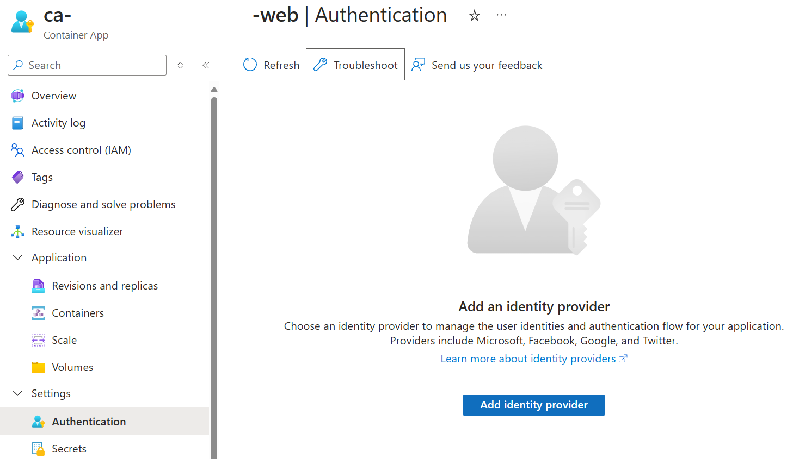
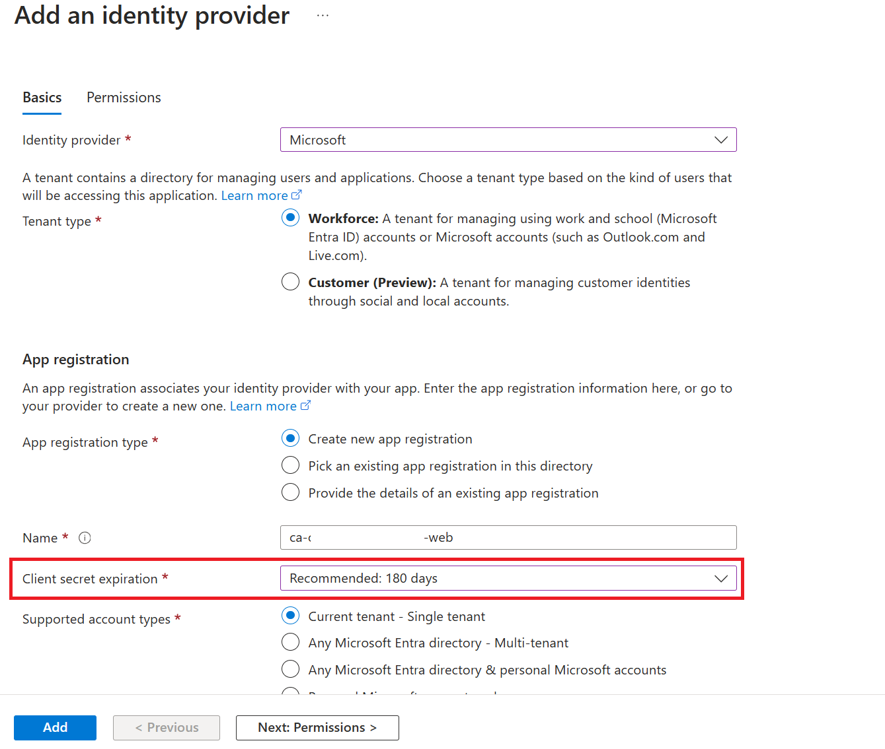
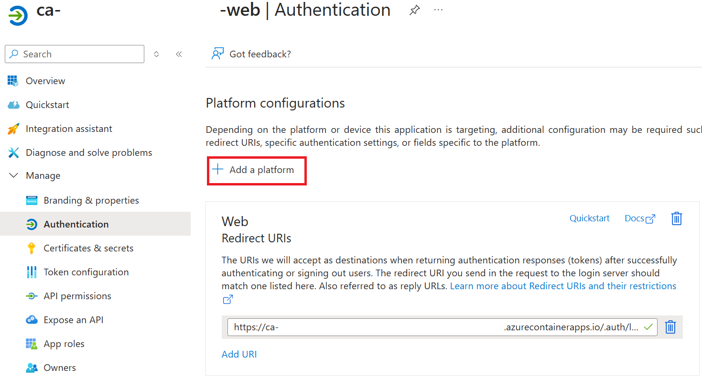
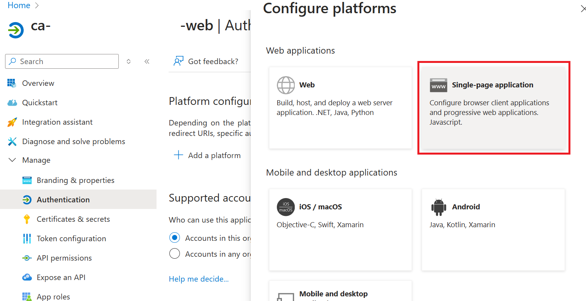
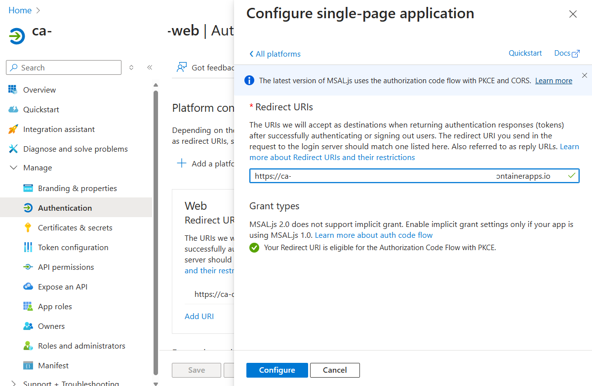
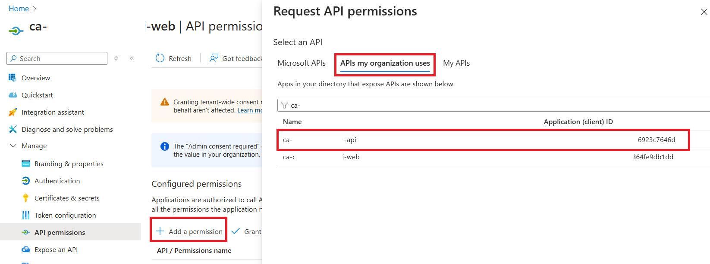
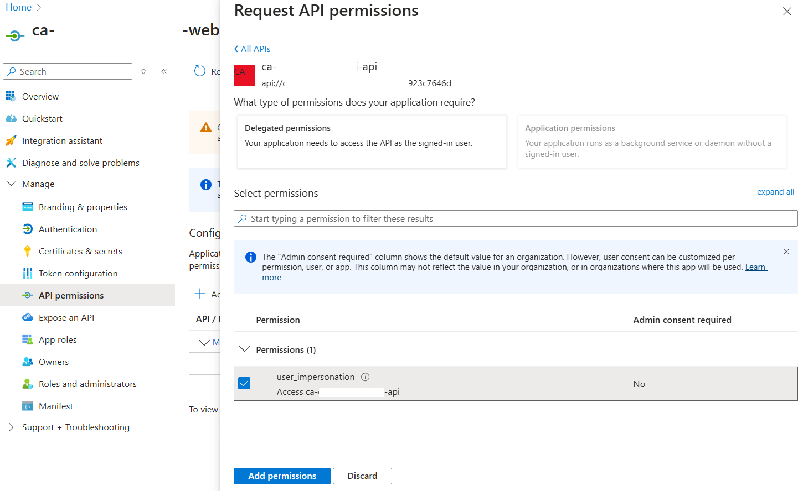
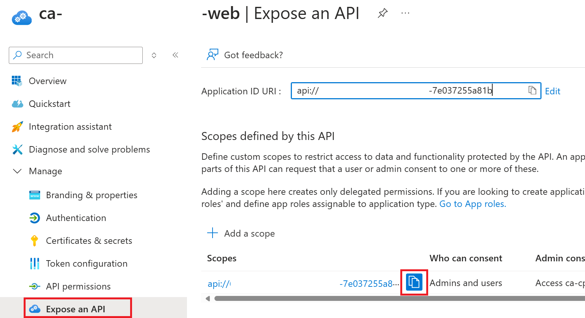
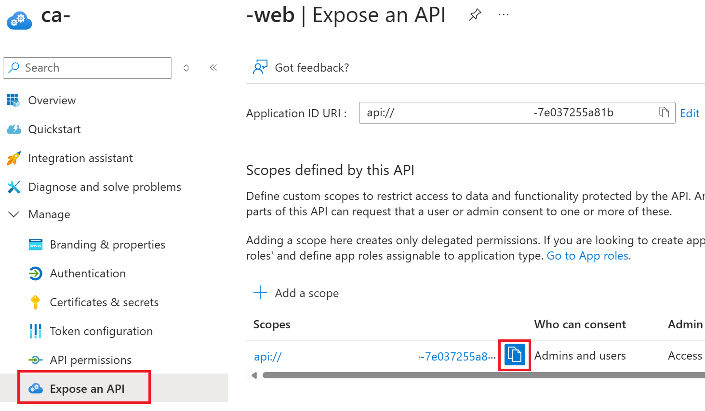
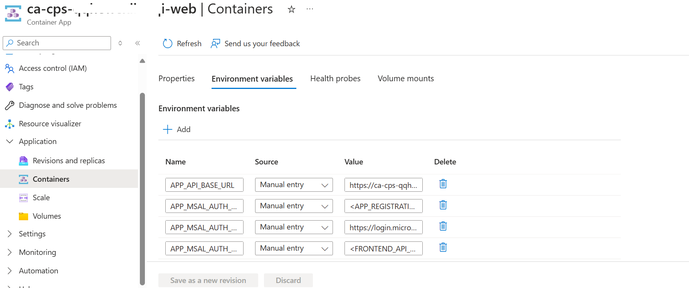

# Set up Authentication in Azure Container App

This document provides step-by-step instructions to configure Azure App Registrations for a front-end and back-end application.

## Prerequisites

- Access to **Microsoft Entra ID**
- Necessary permissions to create and manage **App Registrations**

## Step 1: Add Authentication Provider

We will add Microsoft Entra ID as an authentication provider to API and Web Application.

1. Add Authentication Provider in Web Application

   - Go to deployed Container App and select `ca-cps-<randomname>-web` and click **Add Identity Provider** button in Authentication.  
     

   - Select **Microsoft** and set **Client secret expiration**, then click **Add** button.  
     

    - Set **Unauthenticated requests**, then click **Add** button.  
     

> **Note:** If you encounter the following error message indicating that your organization's policy prohibits the automatic use of secrets, please refer to our [Manual App Registration Configuration](./ManualAppRegistrationConfiguration.md) for detailed manual setup instructions.
>  

1. Add Authentication Provider in API Service

   - Go to deployed Container App and select `ca-cps-<randomname>-api` and click **Add Identity Provider** button in Authentication.  
     

   - Select **Microsoft** and set **Client secret expiration**.  
     

   - Set **Unauthenticated requests**, then click **Add** button.  
     

## Step 2: Configure Application Registration - Web Application

1. Set Redirect URI in Single Page Application Platform

   - Go to deployed Container App `ca-cps-<randomname>-web` and select **Authentication** menu, then select created Application Registration.  
     

   - Select **Authentication**, then select **+ Add a platform** menu.  
     

   - Select **Single-page application**.  
     

   - Add Container App `ca-cps-<randomname>-web`'s URL.  
     

   - You may get this URL from here in your Container App.  
     

2. Add Permission and Grant Permission

   - Add Permission for API application. Select **+ Add a permission** button, then search API application with name `ca-cps-<randomname>-api`.  
       
     

   - Grant admin consent to permissions.  
     

     > ⚠️ **Granting Admin Consent:** If you don't have permission or aren't able to grant admin consent for the API permissions, please follow one of the steps below:  _Option 1 - Reach out to your Tenant Administrator:_ Contact your administrator to let them know your Application Registration ID and what permissions you woud like to have them consent and approve.  _Option 2 - Internal Microsoft Employees Only:_ Please refer to these detailed instructions on the admin consent granting process: [https://aka.ms/AzAdminConsentWiki](https://aka.ms/AzAdminConsentWiki)
     

3. Grab Scope Name for Impersonation

   - Select **Expose an API** in the left menu. Copy the Scope name, then paste it in some temporary place.  
     The copied text will be used for Web Application Environment variable - **APP_WEB_SCOPE**.  
     

4. Grab Client Id for Web App

   - Select **Overview** in the left menu. Copy the Client Id, then paste it in some temporary place.  
     The copied text will be used for Web Application Environment variable - **APP_WEB_CLIENT_ID**.  
     

## Step 3: Configure Application Registration - API Application

1. Grab Scope Name for Impersonation

   - Go to deployed Container App `ca-cps-<randomname>-api` and select **Authentication** menu, then select created Application Registration.  
     

   - Select **Expose an API** in the left menu. Copy the Scope name, then paste it in some temporary place.  
     The copied text will be used for Web Application Environment variable - **APP_API_SCOPE**.  
     

## Step 4: Add Web Application's Client Id to Allowed Client Applications List in API Application Registration

1. Go to the deployed Container App `ca-cps-<randomname>-api`, select **Authentication**, and then click **Edit**.  
   

2. Select **Allow requests from specific client applications**, then click the **pencil** icon to add the Client Id.  
   

3. Add the **Client Id** obtained from [Step 2: Configure Application Registration - Web Application](#step-2-configure-application-registration---web-application), then save.  
   

## Step 5: Update Environment Variable in Container App for Web Application

In previous steps for [Configure Application Registration - Web Application](#step-2-configure-application-registration---web-application) and [Configure Application Registration - API Application](#step-3-configure-application-registration---api-application), we grabbed Client Id for Web App's Application Registration and Scopes for Web and API's Application Registration.

Now, we will edit and deploy the Web Application Container with updated Environment variables.

1. Select **Containers** menu under **Application**. Then click **Environment variables** tab.

2. Update 3 values which were taken in previous steps for **APP_WEB_CLIENT_ID**, **APP_WEB_SCOPE**, **APP_API_SCOPE**.  
Click on **Save as a new revision**.
   The updated revision will be activated soon.

## Conclusion

You have successfully configured the front-end and back-end Azure App Registrations with proper API permissions and security settings.