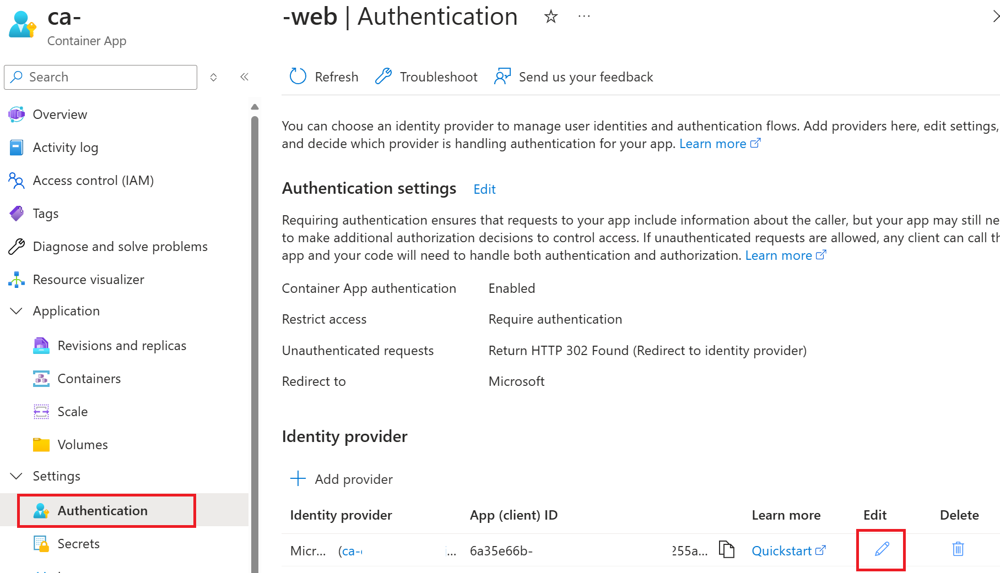
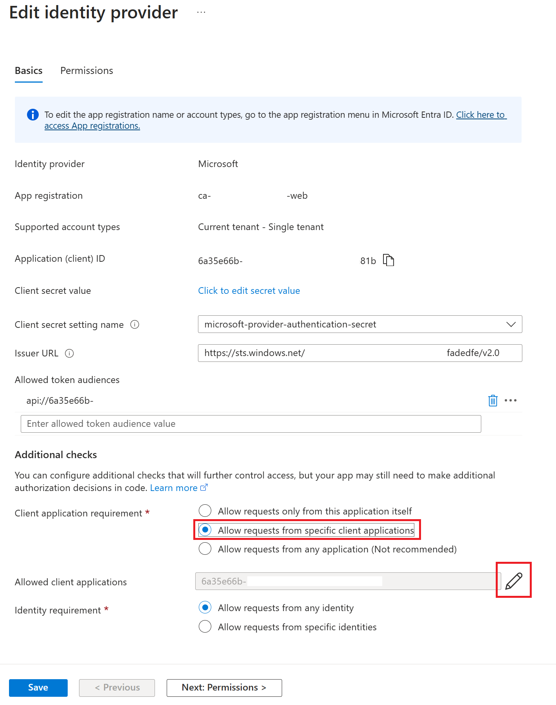

# Set up Authentication in Azure Container App

This document provides step-by-step instructions to configure Azure App Registrations for a front-end and back-end application.

## Prerequisites
- Access to **Azure Active Directory (Azure AD)**
- Necessary permissions to create and manage **App Registrations**

## Step 1: Add Authentication Provider  
We will add Microsoft Entra ID as an authentication provider to API and Web Application. 

1. Add Authentication Provider in Web Application  
 
   - Go to deployed Container App and select ca-< your environment >-< randomname >-web and click **Add Identity Provider** button in Authentication  

   - Select **Microsoft** and set **Client secret expiration** then Click **Add** button  

2. Add Authentication Provider in API Service  
 
    - Go to deployed Container App and select **ca-< your environment >-< randomname >-api** and click **Add Identity Provider** button in Authentication  

    - Select **Microsoft** and set **Client secret expiration**  
  

    - Set **Unauthenticated requests** then Click **Add** button  

## Step 2: Configure Application Registration - Web Application
1. Set Redirect URI in Single Page Application Platform
    - Go to deployed Container App **ca-< your environment >-< randomname >-web** and select **Authentication** menu then select created Application Registration  
  

    - Select **Authentication** then Select **+ Add a platform** menu  
  

    - Select **Single-page application**  

    - Add Container App **ca-< your environment >-< randomname >-web**'s URL  
   
   -  You may get this URL from here in your Container App

2. Add Permission and Grant Permission  
     - Add Permission for API application. Select **+ Add a permission** button then search API application with name **ca-< your environment name >-<unique string>-api**  

      - Grant admin consent to permissions  

3. Grap Scope Name for Impersonation  
      - Select **Expose an API** in left menu. Copy the Scope name then paste in some temporary place.  
      The copied text will be used for Web Application Environment variable - **APP_MSAL_AUTH_SCOPE**.  

4. Grap Client Id for Web App  
      - Select **Overview** in left menu. Copy the Client Id then paste in some temporary place.  
        The copied text will be used for Web Application Environment variable - **APP_MSAL_AUTH_CLIENT_ID**  

  
## Step 3: Configure Application Registration - API Application  
1. Grap Scope Name for Impersonation  
   - Go to deployed Container App **ca-< your environment >-< randomname >-api** and select **Authentication** menu then select created Application Registration  

    - Select **Expose an API** in left menu.Copy the Scope name then paste in some temporary place.  
    The copied text will be used for Web Application Environment variable - **APP_MSAL_TOKEN_SCOPE**.  

2. Grap Client Id for API  
      - Select **Overview** in left menu. Copy the Client Id then paste in some temporary place.  
        The copied text will be used for **allowed  client applications** list

## Step 4: Add API Client Id to Allowed Client Applications list in Web Application's Registration  
1. Go to deployed Container App **ca-< your environment >-< randomname >-web** and select **Authentication** menu then select **Edit**  
 
2. Select **Allow requests from specific client applications** then click **pencil** icon to add client Id  
  
1. Add **Client Id** from [API App registration from previous step] then Save(#step-3-configure-application-registration---api-application).  

## Step 5: Update Environment Variable in Container App for Web Application
In previous 2 steps for [Configure Application Registration - Web Application](#step-2-configure-application-registration---web-application) and [Configure Application Registration - API Application](#step-3-configure-application-registration---api-application), we could grap Client Id for Web App's Application Registration and Scopes for Web and API's Application Registration.  

Now, We will Edit and deploy Web Application Container with updated Environment variables.  

1. Select **Containers** menu under **Application** then **click Edit and Deploy** menu.

2. Select Container image and Click **Edit**. under **Environment variables** sections, update 3 values which were taken in previous steps for **APP_MSAL_AUTH_CLIENT_ID**, **APP_MSAL_AUTH_SCOPE**, **APP_MSAL_TOKEN_SCOPE**.  
Now updated Revision will be activated soon.

## Conclusion
You have successfully configured the front-end and back-end Azure App Registrations with proper API permissions and security settings.