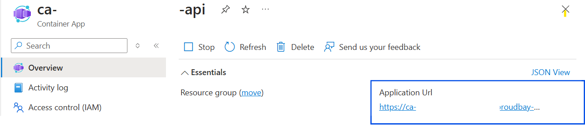

# Deployment Guide

## **Pre-requisites**

To deploy this solution accelerator, ensure you have access to an [Azure subscription](https://azure.microsoft.com/free/) with the necessary permissions to create **resource groups and resources**. Follow the steps in [Azure Account Set Up](./docs/AzureAccountSetUp.md).

Check the [Azure Products by Region](https://azure.microsoft.com/en-us/explore/global-infrastructure/products-by-region/?products=all&regions=all) page and select a **region** where the following services are available:

- [Azure AI Foundry](https://learn.microsoft.com/en-us/azure/ai-foundry/)
- [Azure OpenAI Service](https://learn.microsoft.com/en-us/azure/ai-services/openai/)
- [Azure AI Content Understanding Service](https://learn.microsoft.com/en-us/azure/ai-services/content-understanding/)
- [Azure Blob Storage](https://learn.microsoft.com/en-us/azure/storage/blobs/)
- [Azure Container Apps](https://learn.microsoft.com/en-us/azure/container-apps/)
- [Azure Container Registry](https://learn.microsoft.com/en-us/azure/container-registry/)
- [Azure Cosmos DB](https://learn.microsoft.com/en-us/azure/cosmos-db/)
- [Azure Queue Storage](https://learn.microsoft.com/en-us/azure/storage/queues/)
- [GPT Model Capacity](https://learn.microsoft.com/en-us/azure/ai-services/openai/concepts/models)

Here are some example regions where the services are available: East US, East US2, Australia East, UK South, France Central.

### **Important Note for PowerShell Users**

If you encounter issues running PowerShell scripts due to the policy of not being digitally signed, you can temporarily adjust the `ExecutionPolicy` by running the following command in an elevated PowerShell session:

```powershell
Set-ExecutionPolicy -Scope Process -ExecutionPolicy Bypass
```

This will allow the scripts to run for the current session without permanently changing your system's policy.

## Deployment Options & Steps

Pick from the options below to see step-by-step instructions for GitHub Codespaces, VS Code Dev Containers, Local Environments, and Bicep deployments.

| [](https://codespaces.new/microsoft/content-processing-solution-accelerator) | [](https://vscode.dev/redirect?url=vscode://ms-vscode-remote.remote-containers/cloneInVolume?url=https://github.com/microsoft/content-processing-solution-accelerator) |
|---|---|

<details>
  <summary><b>Deploy in GitHub Codespaces</b></summary>

### GitHub Codespaces

You can run this solution using GitHub Codespaces. The button will open a web-based VS Code instance in your browser:

1. Open the solution accelerator (this may take several minutes):

    [](https://codespaces.new/microsoft/content-processing-solution-accelerator)

2. Accept the default values on the create Codespaces page.
3. Open a terminal window if it is not already open.
4. Continue with the [deploying steps](#deploying-with-azd).

</details>

<details>
  <summary><b>Deploy in VS Code</b></summary>

### VS Code Dev Containers

You can run this solution in VS Code Dev Containers, which will open the project in your local VS Code using the [Dev Containers extension](https://marketplace.visualstudio.com/items?itemName=ms-vscode-remote.remote-containers):

1. Start Docker Desktop (install it if not already installed).
2. Open the project:

    [](https://vscode.dev/redirect?url=vscode://ms-vscode-remote.remote-containers/cloneInVolume?url=https://github.com/microsoft/content-processing-solution-accelerator)

3. In the VS Code window that opens, once the project files show up (this may take several minutes), open a terminal window.
4. Continue with the [deploying steps](#deploying-with-azd).

</details>

<details>
  <summary><b>Deploy in your local Environment</b></summary>

### Local Environment

If you're not using one of the above options for opening the project, then you'll need to:

1. Make sure the following tools are installed:

    - [Azure Developer CLI (azd)](https://aka.ms/install-azd)
    - [Python 3.9+](https://www.python.org/downloads/)
    - [Docker Desktop](https://www.docker.com/products/docker-desktop/)
    - [Git](https://git-scm.com/downloads)

2. Clone the repository or download the project code via command-line:

    ```shell
    azd init -t microsoft/content-processing-solution-accelerator/
    ```

3. Open the project folder in your terminal or editor.
4. Continue with the [deploying steps](#deploying-with-azd).

</details>

<br/>

Consider the following settings during your deployment to modify specific settings:

<details>
  <summary><b>Configurable Deployment Settings</b></summary>

When you start the deployment, most parameters will have **default values**, but you can update the following settings:

| **Setting** | **Description** | **Default value** |
|-------------|-----------------|-------------------|
| **Azure Region** | The region where resources will be created. | East US |
| **Azure AI Content Understanding Location** | Select from a drop-down list of values. | Sweden Central |
| **Secondary Location** | A **less busy** region for **Azure Cosmos DB**, useful in case of availability constraints. | eastus2 |
| **Deployment Type** | Select from a drop-down list. | GlobalStandard |
| **GPT Model** | Choose from **gpt-4, gpt-4o, gpt-4o-mini**. | gpt-4o |
| **GPT Model Deployment Capacity** | Configure capacity for **GPT models**. | 100k |

</details>

<details>
  <summary><b>[Optional] Quota Recommendations</b></summary>

By default, the **GPT model capacity** in deployment is set to **30k tokens**.  
> **We recommend increasing the capacity to 100k tokens for optimal performance.**

To adjust quota settings, follow these [steps](./AzureGPTQuotaSettings.md).

**⚠️ Warning:** Insufficient quota can cause deployment errors. Please ensure you have the recommended capacity or request additional capacity before deploying this solution.

</details>

### Deploying with AZD

Once you've opened the project in [Codespaces](#github-codespaces), [Dev Containers](#vs-code-dev-containers), or [locally](#local-environment), you can deploy it to Azure by following these steps:

1. Login to Azure:

    ```shell
    azd auth login
    ```

    #### To authenticate with Azure Developer CLI (`azd`), use the following command with your **Tenant ID**:

    ```sh
    azd auth login --tenant-id <tenant-id>
    ```

2. Provision and deploy all the resources:

    ```shell
    azd up
    ```

3. Provide an `azd` environment name (e.g., "cpsapp").
4. Select a subscription from your Azure account and choose a location that has quota for all the resources. 
    - This deployment will take *4-6 minutes* to provision the resources in your account and set up the solution with sample data.
    - If you encounter an error or timeout during deployment, changing the location may help, as there could be availability constraints for the resources.

5. Once the deployment has completed successfully, open the [Azure Portal](https://portal.azure.com/), go to the deployed resource group, find the App Service, and get the app URL from `Default domain`.

6. If you are done trying out the application, you can delete the resources by running `azd down`.

### Publishing Local Build Container to Azure Container Registry

If you need to rebuild the source code and push the updated container to the deployed Azure Container Registry, follow these steps:

1. Set the environment variable `USE_LOCAL_BUILD` to `True`:

   - **Linux/macOS**:
     ```bash
     export USE_LOCAL_BUILD=True
     ```

   - **Windows (PowerShell)**:
     ```powershell
     $env:USE_LOCAL_BUILD = $true
     ```

2. Run the `azd up` command again to rebuild and push the updated container:
   ```bash
   azd up
   ```

This will rebuild the source code, package it into a container, and push it to the Azure Container Registry associated with your deployment.

## Post Deployment Steps

1. **Register Schema Files**

     > Want to customize the schemas for your own documents? [Learn more about adding your own schemas here.](./CustomizeSchemaData.md)

    The below steps will add two sample schemas to the solution: _Invoice_ and _Property Loss Damage Claim Form_:

    - **Get API Service's Endpoint**
        - Get API Service Endpoint Url from your container app for API  
          Name is **ca-**<< your environmentName >>-**api**  
            

        - Copy the URL  
    - **Execute Script to registering Schemas**
        - Move the folder to samples/schemas in ContentProcessorApi - [/src/ContentProcessorApi/samples/schemas](/src/ContentProcessorApi/samples/schemas)  

          Bash

          ```bash
          ./register_schema.sh https://<< API Service Endpoint>>/schemavault/ schema_info_sh.json
          ```  

          Windows

          ```Powershell
          ./register_schema.ps1 https://<< API Service Endpoint>>/schemavault/ .\schema_info_ps1.json
          ```  

    - **Verify Results**
          

2. **Import Sample Data**  
    - Grab the Schema IDs for Invoice and Property Damage Claim Form's Schema from first step
    - Move to the folder location to samples in ContentProcessorApi - [/src/ContentProcessorApi/samples/](/src/ContentProcessorApi/samples/)
    - Execute the script with Schema IDs  

        Bash  

        ```bash  
        ./upload_files.sh https://<< API Service Endpoint >>/contentprocessor/submit ./invoices <<Invoice Schema Id>>
        ```

        ```bash
        ./upload_files.sh https://<< API Service Endpoint >>/contentprocessor/submit ./propertyclaims <<Property Loss Damage Claim Form Schema Id>>
        ```

        Windows

        ```powershell
        ./upload_files.ps1 https://<< API Service Endpoint >>/contentprocessor/submit .\invoices <<Invoice Schema Id>>
        ```

        ```powershell
        ./upload_files.ps1 https://<< API Service Endpoint >>/contentprocessor/submit .\propertyclaims <<Property Loss Damage Claim Form Schema Id>>
        ```

3. **Add Authentication Provider**  
    - Follow steps in [App Authentication](./ConfigureAppAuthentication.md) to configure authenitcation in app service. Note that Authentication changes can take up to 10 minutes.  

4. **Deleting Resources After a Failed Deployment**  

     - Follow steps in [Delete Resource Group](./DeleteResourceGroup.md) if your deployment fails and/or you need to clean up the resources.